# Project 3 Computer Graphics

## Compilation

This project has only been tested on MacOS. It is not guaranteed to work
on other platforms.

- Install `googletest` (`brew install googletest` on MacOS)
- Install `boost`
- Go to project root directory `mkdir build`
- `cd build`
- `cmake ..`
- `make`

## Running
`./project3 {input_file}`

# Features 3B

- Everything in 3A

## Transmissive

Below is a modified version of `outdoor.txt`,
which swaps the materials for each sphere. 
The sphere on the left is reflective and the
sphere on the right is transmissive with an
ior of 1.5
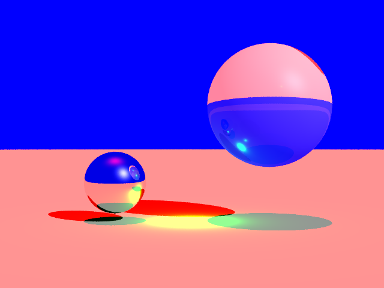

The same image with a 1.1 transmission on the right sphere is  
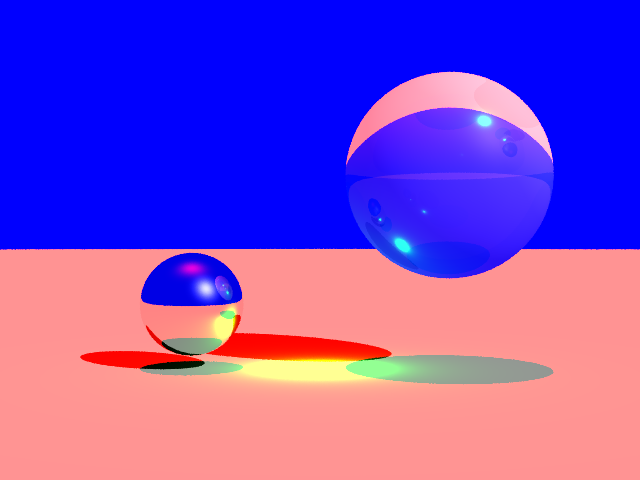

with a 1.01 transmission

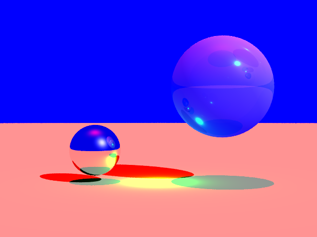

and finally with 1.00 transmission
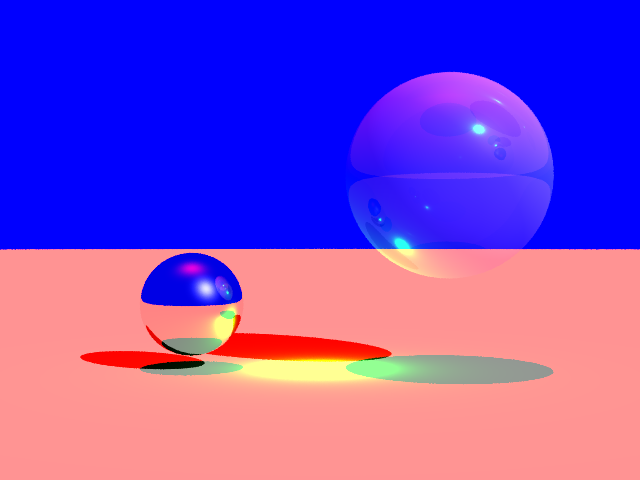


## Reflections

Here is the `outdoor.txt` file with only reflections and no
transmissive term

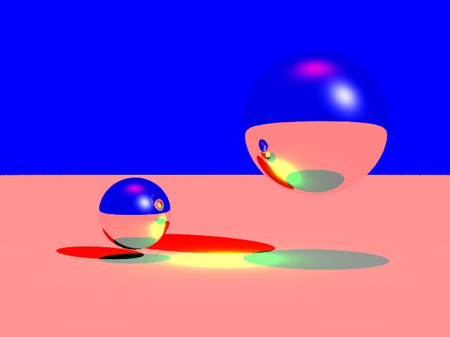

Here is `sphere2.txt` unmodified for reference

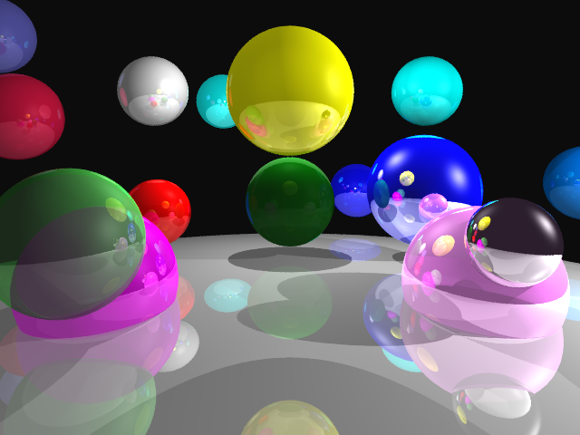

## Recursion to a bounded depth

Here is spheres 2 with recursion to a bounded depth of 2 
(which was the default)


The same with a bounded depth of 1 is

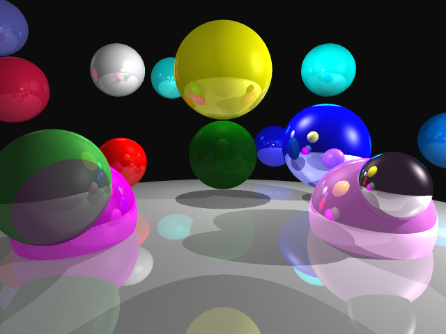
We can see that the red sphere on the right of the yellow sphere is more illuminated
with a bounded depth of 2 than 1.


and with a bounded depth of 0 is
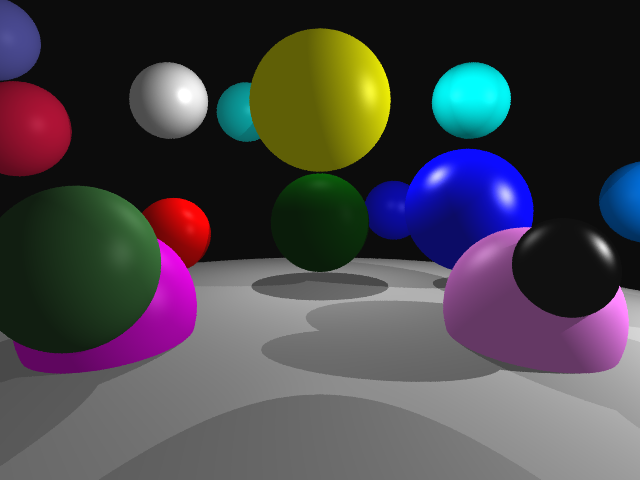
There are no reflections as the depth is limited so no can occur.

## Triangles
Here is `outdoor.txt` with only one triangle
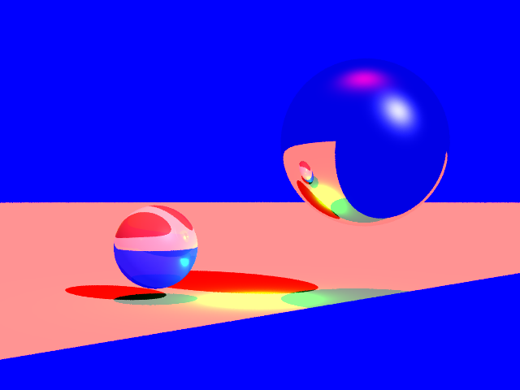

## Planes
Here is `outdoor.txt` but with a triangle replaced with a plane
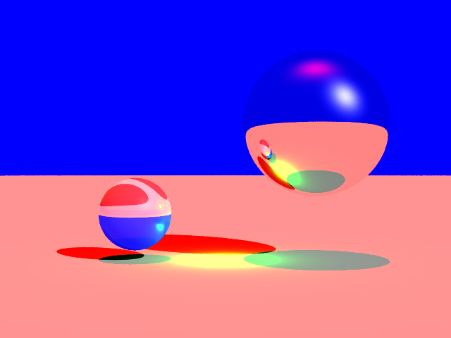

Here it `outdoor.txt` but with one vertex in the plane shifted up a bit.
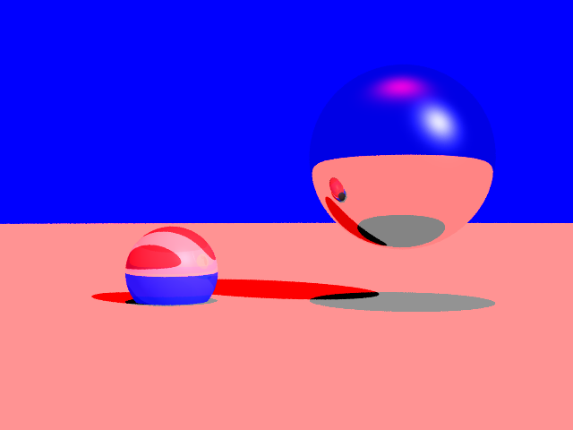

## Boxes
A modified version of `outdoor.txt` with a box
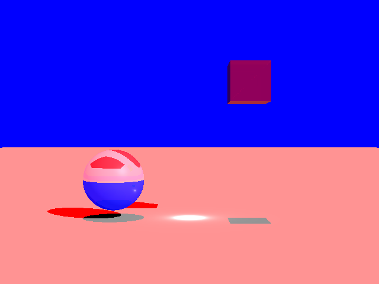


# Features 3A


## Sample Scene 1
We start with 50 samples per pixel on the file [spheres1.txt](.github/spheres1.txt)

<p align="center">

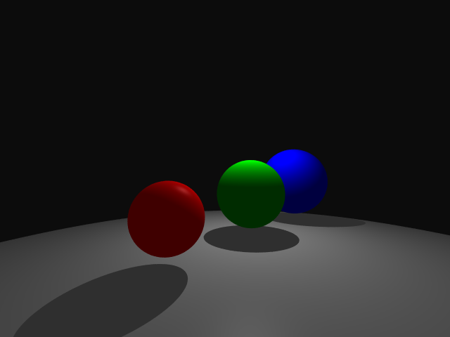

</p>

## Scene Setup

### Camera Placement
<p align="center">

[The viewpoint is adjusted slightly](.github/spheres1-vp.txt)
```text
camera_pos: -6 3 -2
```

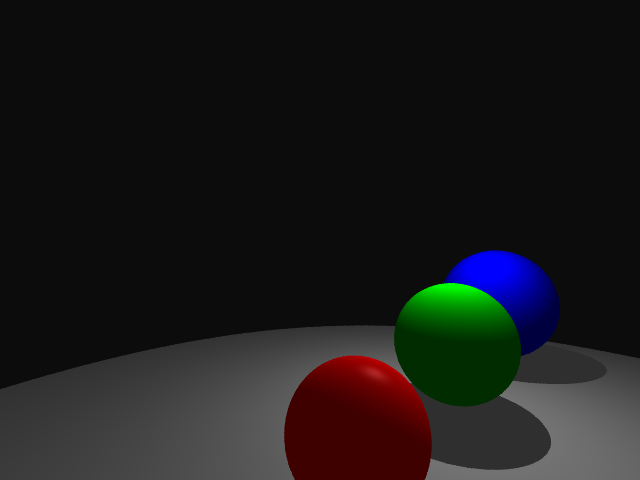

</p>

### Film Resolution (and Aspect Ratio)

<p align="center">

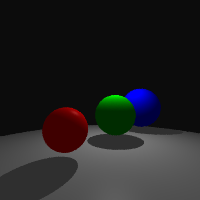

</p>

### Background Colors

<p align="center">

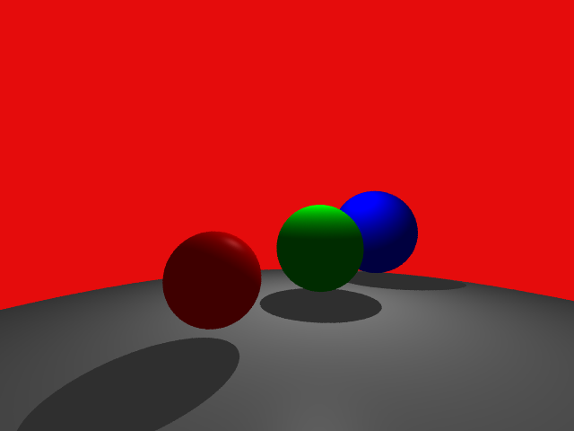

</p>

### PNG Output
- This should be clear


## Primitive
### Spheres
- This should be clear

## Lighting
### Ambient Lights
- This should be apparent by the default image

### Point light sources
- This should be apparent by the default image

### Multiple light sources

<p align="center">


</p>

### Shadows
- This should be apparent by the default image

## Sampling 
- I added a custom command `samples: {#}` to determine the number of samples
- The first sample is always at the center of the pixels
- The rest are randomly distributed between the pixel boundary
- This makes 1 sample equivalent to basic sampling and `n > 1` samples equivalent to
jittered sampling
  
### Basic Sampling
- results in jagged edges
<p align="center">


</p>

### Sampling with `n=100`
- smoother result like box-filtering.

<p align="center">


</p>

## Materials
### Color & Specularity
- This should be apparent by the default image

# Implementation
The code is implemented in C++. Some interesting features

## General
- I really like immutable data, so I made a macro `#define let const auto`
- There are no switch statements for strings in C++. This is an issue for parsing commands.
To get around this I made an unordered map of string to enum and then used the switch
  statement on the enum.
- I use modern C++ 17 features such as destructuring and default nested struct values

## Ray Tracing
- Most of the logic occurs in `Scene` class
- Collision uses the quadratic formula
- Collision which occurs with a `t-value` less than 0.001 is ignored (to prevent shadow acne)
- For each sample loops over all lights and sees if can reach it (to do this needs to iterate over all spheres)
- Shades with appropriate formulas

## Sampling
- See the `Features/Sampling` section

# Challenges
- The switch statements described in the previous 

# Issues
- So far, I do not see any issues in my code (apart from missing features)
- If there is an issue, feel free to create a GitHub issue.


  

